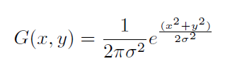
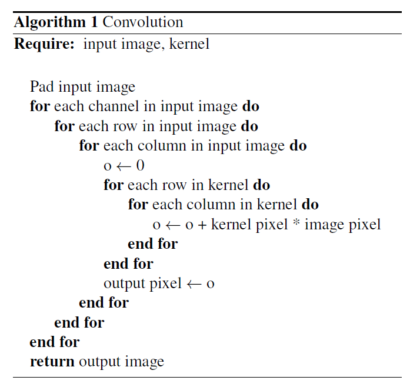
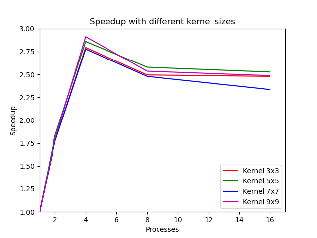
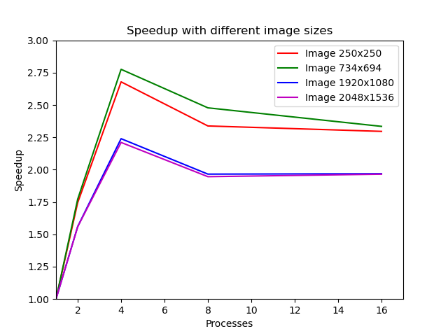

# Kernel Image Processing

An implementation of the Kernel Convolution algorithm in Python using Joblib to achieve parallelization.

## Implementation

The implementation is done in Python and uses the *Pillow* package to load and save images in RGB format, and the *numpy* package for handling arrays. 

The application first loads the image and converts it into a numpy array of shape (height, width, channels).

After that, a gaussian kernel to use for the convolution is generated: a function that takes as parameters the width and the standard deviation, generates a matrix by using the following formula for each value.

where x and y are the distances of each kernel value from the center of the kernel (also called the *origin*). After that, each value is divided by the sum of all kernel values in order to have a weighted average.
The convolution with this type of kernel is used to *blur* the input image.

The pseudo-code of the convolution function is the following:

The image is padded by replicating the border pixels and is done by using the numpy function `pad`.

After the convolution, the output array is converted to an image and saved on a file. 

## Parallelization

To achieve parallelization, the image was split in sub-images of equal size and each slice was used by a Joblib process to perform the convolution with the kernel.
To avoid the copy of the input image for each process, and as a consequence a slow instantiation, the `joblib.dump()` and `joblib.load()` functions to save and reload the numpy array efficiently were used.
So the main process saves the array on disk and deletes it at the end of the function, while each process loads the file to perform the convolution.

To recap, the main process:
* Creates the padded array from the input.
* Saves the padded array on disk in a compressed format.
* Splits the original image in sub-images.
* Instantiates the sub-processes with the `Parallel` class, each with their own parameters.
* After all sub-processess terminate, the output image is built from the returned slices.

While each process performs the convolution for its image slice.

## Speedup Results

Speedup results with a fixed test image of size 734x694 with varying kernel sizes.

Speedup results with a fixed 7x7 kernel and input images of different sizes.

